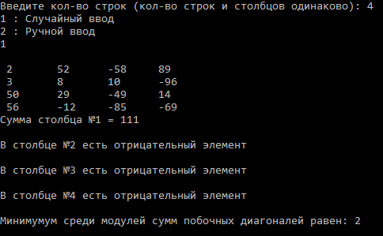

# Работа с двумерным массивом
Простая программа. Поиск сумм столбцов и нахождение минимумум среди модулей сумм побочных диагоналей.
<h1>Сожержание</h1>
  <ul>
    <li><a href="#task">Задача</a></li>
    <li><a href="#result">Результат работы программы</a></li>
    <li><a href="#experience">Полученный мною опыт</a></li>
  </ul>
<h2 id="task">Задача</h2>

  Задается двумерный квадратный массив. (Значения заполняются рандомно или с клавиатуры пользователем).

  Значение суммы каждого столбца вычисляется при условии отсутсвия отрицательного элемента в этом же столбце.

  Также нахождится минимумум среди модулей сумм побочных диагоналей.

<h2 id="result">Результат работы программы</h2>

<h2 id="experience">Полученный мною опыт</h2>
  <ul>
    <li>Работа с C#;</li>
    <li>Узнал что такое двумерный массив и как с ним работать (использование, сортировка и т.п.);</li>
    <li>Лишний раз вспомнил математику начальных классов :)</li>
  </ul>
